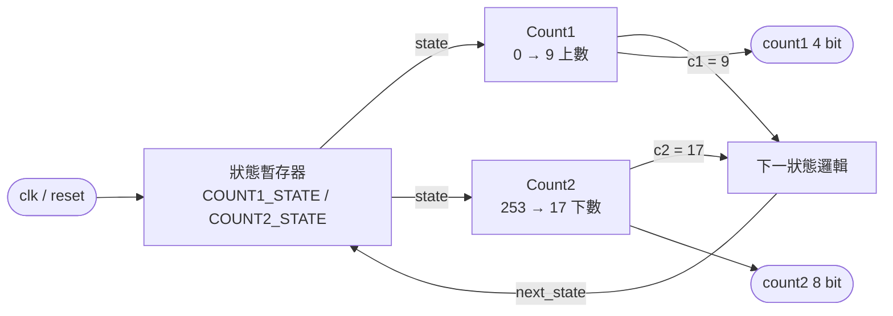

# HW1 雙計數器狀態機

## 用途

以兩狀態 FSM 交替驅動兩組計數器，練習 VHDL 同步設計的基本寫法：
狀態暫存器、下一狀態組合邏輯、受狀態致能的計數器分開撰寫。

- 目標器件：`xc7k70tfbv676-1`
- Top 模組：`HW_1`，測試檔：`HW_1_tb`

## 架構



| 狀態 | 動作 | 轉移條件 |
|---|---|---|
| `COUNT1_STATE` | `c1` 由 0 上數到 9，`c2` 保持 253 | `c1 = 9` 時轉到 `COUNT2_STATE`，`c1` 歸零 |
| `COUNT2_STATE` | `c2` 由 253 下數到 17，`c1` 保持 0 | `c2 = 17` 時轉回 `COUNT1_STATE`，`c2` 回到 253 |

- 單一時脈域，`reset` 為同步、高電位有效；reset 後回到 `COUNT1_STATE`、`c1 = 0`、`c2 = 253`。
- 一個完整循環為 10 + 237 = 247 個 clk。

### 介面

| Port | 方向 | 寬度 | 說明 |
|---|---|---|---|
| `clk` | in | 1 | 系統時脈 |
| `reset` | in | 1 | 同步 reset，高電位有效 |
| `count1` | out | 4 | Count1 目前值 |
| `count2` | out | 8 | Count2 目前值 |

## 檔案

| 路徑 | 內容 |
|---|---|
| `src/HW_1.vhd` | 設計原始碼 |
| `sim/HW_1_tb.vhd` | 測試檔：10 ns 時脈，reset 2 拍後放開，模擬 3000 ns（約 1.2 個循環） |
| `Create-Project.tcl` | 由本目錄原始碼建立 Vivado 專案 |
| `Import-FromVivado.ps1` | 從舊 Vivado 專案匯入 HW1 檔案 |

## 使用

在儲存庫根目錄執行：

```powershell
.\Manage-FPGA.ps1 import HW1   # 從舊專案匯入（內容不同會停止，覆蓋請加 -Update）
.\Manage-FPGA.ps1 create HW1   # 建立 vivado/HW1/HW1.xpr，已存在時不要重複執行
.\Manage-FPGA.ps1 open HW1
```

匯入來源預設為 `D:\Documents\vivado_2\project_1`，可用
`-VivadoProjectPath 'D:\path\to\project'` 指定其他位置。詳細流程見根目錄 `README.md`。
