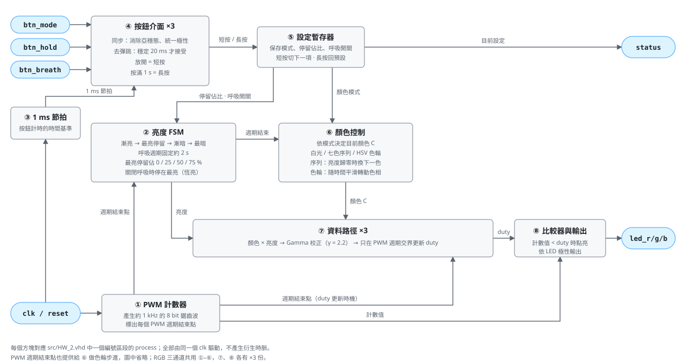

# HW2 RGB 呼吸燈（作業版：[HW2_a](../HW2_a/README.md)）

## 用途

以 PWM 驅動 RGB LED，亮度依固定週期平滑地「漸亮 → 漸暗」循環，並可透過三顆按鈕
切換顏色模式、最亮停留時間與呼吸／恆亮。完整規格與設計理由見 [`SPEC.md`](SPEC.md)。

- 目標器件：`xc7k70tfbv676-1`（與 HW1 相同）
- Top 模組：`HW_2`，測試檔：`HW_2_tb`
- 全同步設計、單一時脈域；時間參數皆為 generic，模擬時可縮短

## 架構

每個方塊是一個 process（編號對應 `src/HW_2.vhd` 的區段），圖中只寫它負責的功能。



| Process | 功能 | 規格章節 |
|---|---|---|
| ① PWM 計數器 | 前除頻 390 + 8 bit 計數，約 1 kHz；標出每個 PWM 週期結束點 | §4 |
| ② 亮度 FSM | 漸亮 → 最亮停留 → 漸暗 → 最暗，週期固定約 2 s；停留佔比可切換，關閉呼吸時恆亮 | §5.1、§5.3、§5.4 |
| ③ 1 ms 節拍 | 提供按鈕去彈跳與長按計時的時間基準 | §7.2 |
| ④ 按鈕介面 ×3 | 同步、20 ms 去彈跳；放開為短按，按滿 1 s 為長按 | §7.2 |
| ⑤ 設定暫存器 | 保存 `mode` / `hold_sel` / `breath_en`，短按切下一項、長按回預設；同時輸出 `status` | §7.1、§7.4 |
| ⑥ 顏色控制 | 固定白光／七色序列（亮度歸零時換色）／HSV 色輪 | §6 |
| ⑦ 資料路徑 ×3 | 顏色 × 亮度 → Gamma 校正（γ = 2.2）→ 只在 PWM 週期交界更新 duty，避免殘缺脈波 | §4.2、§5.2、§6.1 |
| ⑧ 比較器與輸出 ×3 | 計數值 < duty 時點亮，依 LED 極性輸出 | §4.2 |

### 介面

| Port | 方向 | 寬度 | 說明 |
|---|---|---|---|
| `clk` / `reset` | in | 1 | 系統時脈；同步 reset，高電位有效 |
| `btn_mode` | in | 1 | 顏色模式：白光 → 序列 → 色輪 |
| `btn_hold` | in | 1 | 最亮停留佔比：0% / 25% / 50% / 75%（呼吸週期固定不變） |
| `btn_breath` | in | 1 | 呼吸／恆亮切換 |
| `led_r` / `led_g` / `led_b` | out | 1 | PWM 輸出 |
| `status` | out | 5 | `mode`(1:0)、`hold_sel`(3:2)、`breath_en`(4) |

主要 generic：`CLK_FREQ_HZ`、`PWM_BITS`、`PWM_DIV`、`CYCLE_PERIODS`、`GAMMA_EN`、
`LED_ACTIVE_LOW`、`BTN_ACTIVE_LOW` 等，預設值與說明見 SPEC §3.1。

## 檔案

| 路徑 | 內容 |
|---|---|
| `SPEC.md` | 設計規格：參數計算、FSM、顏色與按鈕行為、驗證計畫 |
| `src/HW_2.vhd` | 設計原始碼 |
| `sim/HW_2_tb.vhd` | 自我檢查測試檔，涵蓋 SPEC §9 全部項目；`run all` 後印出 PASS / FAIL |
| `Create-Project.tcl` | 由本目錄原始碼建立 Vivado 專案 |
| `Import-FromVivado.ps1` | 從舊 Vivado 專案匯入 HW2 檔案 |
| `docs/architecture.svg` | 架構圖（各 process 功能） |

## 進度與待辦

- [x] 規格（`SPEC.md`）
- [x] 設計原始碼（`src/HW_2.vhd`）
- [x] 測試檔（`sim/HW_2_tb.vhd`，xsim 2018.3 通過）
- [ ] 約束檔：板子型號、時脈、LED 與按鈕腳位確認後建立 `constraints/`（見 SPEC §10）

## 使用

在儲存庫根目錄執行：

```powershell
.\Manage-FPGA.ps1 import HW2   # 從舊專案匯入（內容不同會停止，覆蓋請加 -Update）
.\Manage-FPGA.ps1 create HW2   # 建立 vivado/HW2/HW2.xpr，已存在時不要重複執行
.\Manage-FPGA.ps1 open HW2
```

舊專案目錄中雖有 HW2 測試檔，但專案設定尚未納入；匯入腳本會直接從
`project_1.srcs` 找到它。匯入來源預設為 `D:\Documents\vivado_2\project_1`，可用
`-VivadoProjectPath 'D:\path\to\project'` 指定其他位置。詳細流程見根目錄 `README.md`。
