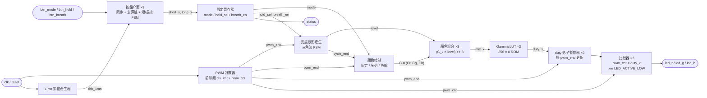
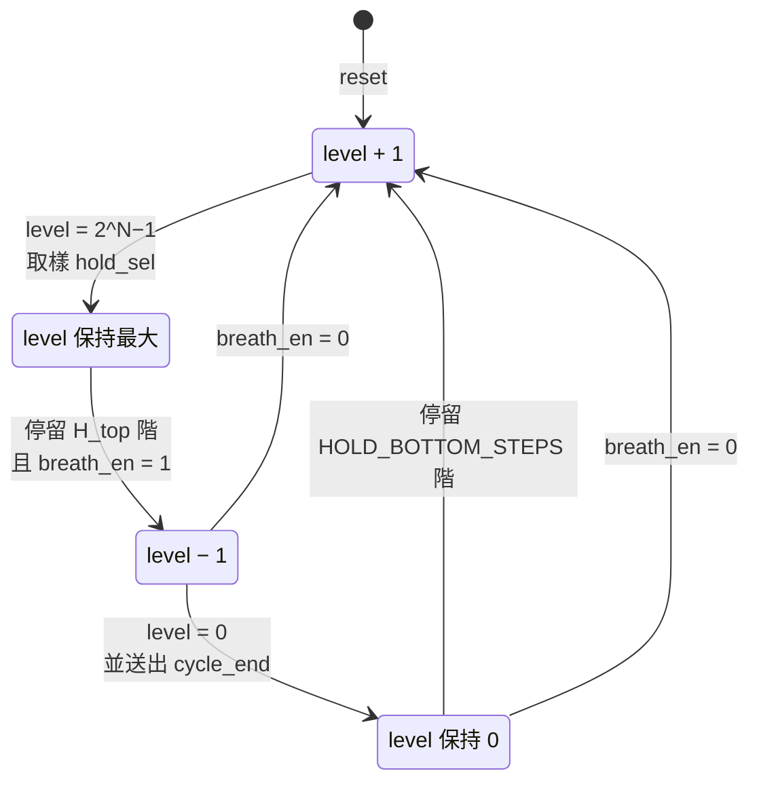
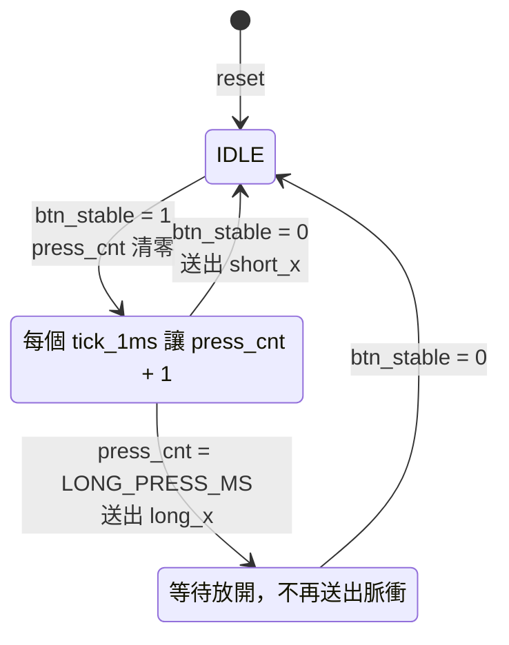

# HW2 呼吸燈規格

## 1. 目標

以 PWM 驅動 RGB LED，亮度依固定週期平滑地「漸亮 → 漸暗」循環，並可切換或漸變顏色。
設計為全同步電路，只有單一時脈域，所有時間參數皆以 generic 設定，方便在
模擬時縮短時間。

- 目標器件：`xc7k70tfbv676-1`（與 HW1 相同）
- 語言：VHDL（`ieee.numeric_std`）
- Top 模組：`HW_2`，測試檔：`HW_2_tb`

## 2. 架構



各子模組都由 `clk` 驅動，時序控制一律使用單週期致能脈衝（`pwm_tick`、`pwm_end`、
`cycle_end`、`tick_1ms`、`short_x`、`long_x`），不產生衍生時脈。

## 3. 介面

### 3.1 Generic

| 名稱 | 型別 | 預設值 | 說明 |
|---|---|---|---|
| `CLK_FREQ_HZ` | natural | 100_000_000 | 系統時脈頻率（待確認板子） |
| `PWM_BITS` | natural | 8 | PWM 解析度 N，duty 範圍 0 ~ 2^N−1 |
| `PWM_DIV` | natural | 390 | PWM 計數器前除頻，每 `PWM_DIV` 個 clk 計數一次 |
| `STEP_PERIODS` | natural | 4 | 亮度每前進一階所需的 PWM 週期數 |
| `HOLD_BOTTOM_STEPS` | natural | 0 | 最暗點停留的階數 |
| `GAMMA_EN` | boolean | true | 是否啟用 gamma 校正 |
| `LED_ACTIVE_LOW` | boolean | false | LED 低電位點亮時設為 true（共陽極 RGB LED） |
| （內部常數）`TICK_DIV` | — | `CLK_FREQ_HZ / 1000` | 1 ms 節拍的除頻值，模擬時改小 `CLK_FREQ_HZ` 即可縮短 |
| `DEBOUNCE_MS` | natural | 20 | 去彈跳：按鈕需連續穩定的節拍數 |
| `LONG_PRESS_MS` | natural | 1000 | 長按門檻節拍數 |
| `BTN_ACTIVE_LOW` | boolean | false | 按鈕按下為低電位時設為 true |

### 3.2 Port

| 名稱 | 方向 | 寬度 | 說明 |
|---|---|---|---|
| `clk` | in | 1 | 系統時脈 |
| `reset` | in | 1 | 同步、高電位有效（與 HW1 相同） |
| `btn_mode` | in | 1 | 切換顏色模式，見第 7 節 |
| `btn_hold` | in | 1 | 切換最大亮度佔比，見第 7 節 |
| `btn_breath` | in | 1 | 切換呼吸／恆亮，見第 7 節 |
| `led_r` / `led_g` / `led_b` | out | 1 | PWM 輸出，各自經暫存器輸出 |
| `status` | out | 5 | 目前設定，接板上一般 LED，見 7.4 |

`mode`、`hold_sel`、`breath_en` 改為內部設定暫存器，由按鈕操作（第 7 節），不再是輸入 port。

## 4. PWM 參數

### 4.1 計算式

```text
f_pwm = CLK_FREQ_HZ / (PWM_DIV × 2^PWM_BITS)
duty  = duty_x / 2^PWM_BITS
```

預設值：100 MHz / (390 × 256) ≈ **1001.6 Hz**，解析度 8 bit（256 階）。

| 參數 | 值 | 理由 |
|---|---|---|
| PWM 頻率 | ≈ 1 kHz | 遠高於人眼閃爍門檻（約 100 Hz），又低到 LED 驅動與走線不受影響 |
| 解析度 | 8 bit | 配合 gamma 後暗部仍有足夠階數；若暗部有明顯跳階，可改為 10 bit |
| duty 範圍 | 0 ~ 255 | 0 = 全暗；255 = 255/256 ≈ 99.6%（不需要 100%） |

### 4.2 硬體行為

- 前除頻器 `div_cnt`：0 ~ `PWM_DIV`−1 循環，歸零時產生 `pwm_tick`。
- PWM 計數器 `pwm_cnt`（`PWM_BITS` bit）：每個 `pwm_tick` 加 1，自然溢位回 0；
  由 `2^N−1` 回到 0 的那一拍產生 `pwm_end`。
- 輸出：`led_x <= '1' when pwm_cnt < duty_x else '0'`，需經暫存器輸出，避免組合邏輯毛刺。
- **duty 只在 `pwm_end` 時更新**（影子暫存器），確保單一 PWM 週期內 duty 不變，
  不會產生不完整的脈波。

## 5. 過渡函數（亮度波形）

### 5.1 線性三角波

亮度等級 `level`（`PWM_BITS` bit）以上下計數器實作：



- 狀態：`UP`、`HOLD_TOP`、`DOWN`、`HOLD_BOTTOM` 四狀態 FSM，寫法與 HW1 一致。
- 每累計 `STEP_PERIODS` 個 `pwm_end` 前進一階；停留狀態以 `hold_cnt`（N+1 bit）計數階數，
  停留 0 階時直接轉移。
- 亮度降到 0（進入 `HOLD_BOTTOM`）時產生一拍 `cycle_end`，供顏色控制換色。

呼吸週期（R = 2^N − 1 為單程階數，`H_top` 見 5.3）：

```text
T_breath = (2R + H_top + HOLD_BOTTOM_STEPS) × STEP_PERIODS / f_pwm
```

`hold_sel = 00`、`HOLD_BOTTOM_STEPS = 0` 時：510 × 4 / 1001.6 ≈ **2.04 s**。常見舒適範圍約 2 ~ 4 s，可調 `STEP_PERIODS`
（每 +1 約增加 0.51 s）。

### 5.2 Gamma 校正

人眼對亮度的感受接近對數，線性 duty 會讓燈「很快變亮、長時間停在亮處」。因此在比較器前
加入 gamma 查表：

```text
gamma(x) = round( (2^N − 1) × (x / (2^N − 1))^2.2 )
```

- 實作為 `2^N × N bit` 的常數 ROM（預設 256 × 8 bit），以 VHDL 函式在 elaboration 時由
  `ieee.math_real` 計算產生，不需手動輸入表格；Vivado 會推論成 LUT/分散式 ROM。
- ROM 輸出經暫存器，延遲 1 拍，不影響功能（duty 只在 `pwm_end` 取用）。
- 性質：`gamma(0) = 0`、`gamma(2^N−1) = 2^N−1`、單調不減。
- `GAMMA_EN = false` 時直接旁路，用於對照比較。

### 5.3 最大亮度時間佔比（`hold_sel`）

在 `HOLD_TOP` 停留 `H_top` 階。停留階數以單程階數 R 的倍數定義，只需移位、不需乘法，
改變 `PWM_BITS` 時佔比也不變：

```text
D_top = H_top / (2R + H_top + HOLD_BOTTOM_STEPS)
```

| `hold_sel` | `H_top` | N = 8 時階數 | 最亮佔比 D_top | 呼吸週期（預設） |
|---|---|---|---|---|
| `00` | 0 | 0 | 0% | 2.04 s |
| `01` | R / 2 | 127 | 19.9% | 2.54 s |
| `10` | R | 255 | 33.3% | 3.06 s |
| `11` | 2R | 510 | 50.0% | 4.07 s |

（佔比與週期以 `HOLD_BOTTOM_STEPS = 0`、`STEP_PERIODS = 4` 計算。）

- 佔比指「亮度停在最大值」的時間比例；漸亮與漸暗的速度不變，所以佔比越高週期越長。
- `hold_sel` 只在進入 `HOLD_TOP` 的那一拍取樣並鎖存到 `H_top`，按鈕切換不會打斷正在進行的
  停留，新值從下一次最亮開始生效。

### 5.4 呼吸開關（`breath_en`）

| `breath_en` | 行為 |
|---|---|
| `'1'` | 正常呼吸，依 5.1 循環 |
| `'0'` | 恆亮：`level` 平滑升到最大後停在 `HOLD_TOP` |

- 關閉時若在 `DOWN` 或 `HOLD_BOTTOM`，轉回 `UP` 繼續漸亮；若在 `UP` 則照常升到最大。
  亮度不會跳變。
- 關閉期間停在 `HOLD_TOP`，不產生 `cycle_end`；重新開啟後，停滿 `H_top` 階（已停留的
  階數也算）即進入 `DOWN`。
- 恆亮時顏色仍由 `mode` 決定：`01` 單色序列因沒有 `cycle_end` 而停在目前顏色；
  `10` 色輪照常旋轉。

## 6. 顏色函數

### 6.1 顏色混合

每個色版以 8 bit 表示目標顏色 `C = (Cr, Cg, Cb)`，再乘上亮度：

```text
mix_x  = (C_x × level) >> 8        -- x ∈ {r, g, b}，8×8 → 16 bit 取高 8 bit
duty_x = gamma(mix_x)              -- GAMMA_EN = true 時
```

- 先乘亮度再做 gamma，三個色版的比例在任何亮度下都一致，顏色不會隨呼吸偏色。
- 以 `>> 8` 近似除以 255，最大亮度會少約 0.4%，可接受，省去除法器。
- 三個 8×8 乘法器，Vivado 可推論為 DSP48 或 LUT；乘法結果經暫存器。

### 6.2 顏色模式（`mode`）

| `mode` | 名稱 | 行為 |
|---|---|---|
| `00` | 固定白光 | `C = (255, 255, 255)` |
| `01` | 單色序列 | 每個 `cycle_end` 切換到下一色：紅 → 黃 → 綠 → 青 → 藍 → 洋紅 → 白 → 紅 … |
| `10` | 色輪漸變 | 色相在呼吸過程中連續旋轉，見 6.3 |
| `11` | 保留 | 行為同 `00` |

- 單色序列以 7 筆常數 ROM（每筆 24 bit）加 3 bit 索引實作。
- **切換顏色只在 `cycle_end`（亮度為 0）時發生**，因此換色不會被看見跳變。
- 例外：以按鈕切換 `mode` 時**立即生效**（見 7.3），讓操作有即時回饋；單色序列從紅色開始。

### 6.3 色輪（HSV 色相，S = V = 最大）

色相計數器 `hue`：0 ~ 1535（6 段 × 256），每個 `pwm_end` 前進一階（以 `STEP_PERIODS`
控制速度），繞一圈約 1536 × 4 / 1001.6 ≈ 6.1 s。以 `seg = hue / 256`、`f = hue mod 256`
分段線性產生 RGB，只需比較與加減、無乘法：

| `seg` | R | G | B | 色相範圍 |
|---|---|---|---|---|
| 0 | 255 | f | 0 | 紅 → 黃 |
| 1 | 255 − f | 255 | 0 | 黃 → 綠 |
| 2 | 0 | 255 | f | 綠 → 青 |
| 3 | 0 | 255 − f | 255 | 青 → 藍 |
| 4 | f | 0 | 255 | 藍 → 洋紅 |
| 5 | 255 | 0 | 255 − f | 洋紅 → 紅 |

色輪輸出同樣送入 6.1 的顏色混合，因此會同時「呼吸」與「換色」。

## 7. 按鈕互動

### 7.1 操作對照

| 按鈕 | 短按（< 1 s） | 長按（≥ 1 s） |
|---|---|---|
| `btn_mode` | 顏色模式 `00 → 01 → 10 → 00`（跳過保留的 `11`） | 顏色模式回到預設 `00` |
| `btn_hold` | 最亮佔比 `00 → 01 → 10 → 11 → 00` | 最亮佔比回到預設 `00` |
| `btn_breath` | 呼吸／恆亮切換 | 回到預設「呼吸」 |

- 規則一致：**短按 = 下一個選項，長按 = 該項回預設**。要一次回復全部設定，用 `reset`。
- 三顆按鈕各自獨立處理，同時按下時各自生效，互不影響。

### 7.2 按鈕訊號處理

每顆按鈕一套相同電路，全部由 `tick_1ms` 驅動，時間不受 PWM 參數影響：

1. **極性與同步**：`btn_x xor BTN_ACTIVE_LOW` 後經兩級正反器同步。
2. **去彈跳**：每個 `tick_1ms` 比較同步後的值與目前穩定值 `btn_stable`；連續 `DEBOUNCE_MS`
   拍不同才更新 `btn_stable`，否則計數器清零。按下與放開都需穩定 20 ms。
3. **短／長按 FSM**：以 `btn_stable` 為輸入，輸出單拍脈衝 `short_x`、`long_x`。



- 短按在**放開時**觸發，才能與長按區分；長按在滿 1 s 時立即觸發，不必等放開。
- 一次按壓只會產生一個脈衝：短按或長按擇一。
- 每顆按鈕的硬體：同步 2 FF、去彈跳計數器 5 bit、`press_cnt` 10 bit、3 狀態 FSM。

### 7.3 設定生效時機

| 設定 | 生效時機 | 理由 |
|---|---|---|
| `mode` | 下一個 `pwm_end`（立即） | 按下後需馬上看到變化；換色瞬間的跳變可接受 |
| `hold_sel` | 下一次進入 `HOLD_TOP` | 避免停留中途被截斷或延長，見 5.3 |
| `breath_en` | 立即，依 5.4 平滑過渡 | FSM 本身保證亮度不跳變 |

### 7.4 狀態指示（`status`）

`hold_sel` 最多延遲一個呼吸週期才看得到效果，所以把設定值直接接到板上 LED 顯示：

| bit | 內容 |
|---|---|
| `status(1 downto 0)` | `mode` |
| `status(3 downto 2)` | `hold_sel` |
| `status(4)` | `breath_en` |

`status` 為一般電位輸出、不做 PWM；板上沒有空閒 LED 時可不接腳位。

## 8. Reset 行為

`reset = '1'` 時所有計數器歸零，`level = 0`，FSM 回到 `UP`，`H_top` 鎖存值清為 0，顏色索引與 `hue` 回到 0（紅色，
`mode = 00` 時為白色），LED 輸出為熄滅電位。設定暫存器回到預設：`mode = 00`、
`hold_sel = 00`、`breath_en = '1'`；按鈕 FSM 回到 `IDLE`。

## 9. 驗證計畫（`HW_2_tb`）

模擬時覆寫 generic 以縮短時間，例如 `PWM_BITS = 4`、`PWM_DIV = 2`、`STEP_PERIODS = 1`、
`CLK_FREQ_HZ = 10_000`（1 ms = 10 clk）、`DEBOUNCE_MS = 3`、`LONG_PRESS_MS = 20`。

| 項目 | 檢查方式 |
|---|---|
| PWM 週期 | 量測 `led_r` 兩個上升緣間距 = `PWM_DIV × 2^N` 個 clk |
| duty 正確 | 每個 PWM 週期的高電位 clk 數 = `PWM_DIV × duty_x` |
| 無毛刺 | duty 只在 `pwm_end` 改變；單一週期內只有一次上升與下降 |
| 三角波 | `level` 由 0 單調升至最大再單調降回 0，週期符合 5.1 公式 |
| Gamma | `gamma(0) = 0`、`gamma(max) = max`、單調不減 |
| 換色時機 | `mode = 01` 時顏色索引只在 `level = 0` 時改變 |
| 色輪 | `hue` 每段交界 RGB 連續，無跳變 |
| 最亮佔比 | 各 `hold_sel` 下 `HOLD_TOP` 持續階數符合 5.3 表格；停留中切換 `hold_sel` 不影響本次停留 |
| 呼吸開關 | 在四個狀態下分別短按 `btn_breath` 關閉呼吸，`level` 都單調升到最大並保持；再按一次恢復循環 |
| 極性 | `LED_ACTIVE_LOW = true` 時輸出反相 |
| 去彈跳 | 按鈕輸入加入短於 `DEBOUNCE_MS` 的抖動脈衝，`btn_stable` 不變、不產生動作 |
| 短按 | 按住少於 `LONG_PRESS_MS` 後放開，放開時送出一次 `short_x`，設定前進一格 |
| 長按 | 按住超過 `LONG_PRESS_MS`，滿門檻時送出一次 `long_x`，放開時不再送出 `short_x` |
| 同時按 | 同時按下兩顆按鈕，兩項設定各自正確改變 |
| 狀態指示 | `status` 與設定暫存器一致 |

## 10. 待確認

- 板子型號與時脈頻率（目前假設 100 MHz）。
- LED 型式：單色 LED 或 RGB LED、共陽或共陰（決定 `LED_ACTIVE_LOW`）、腳位配置（XDC）。
- 板上按鈕數量與極性（需 3 顆，加上 `reset` 共 4 顆；決定 `BTN_ACTIVE_LOW`）。
- 板上是否有 5 顆空閒 LED 可接 `status`。
- 作業是否指定呼吸週期、PWM 頻率或解析度。
