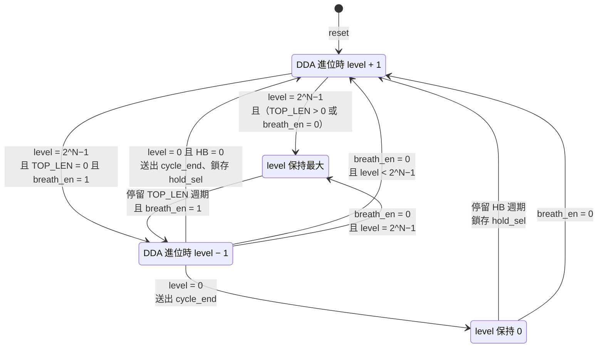
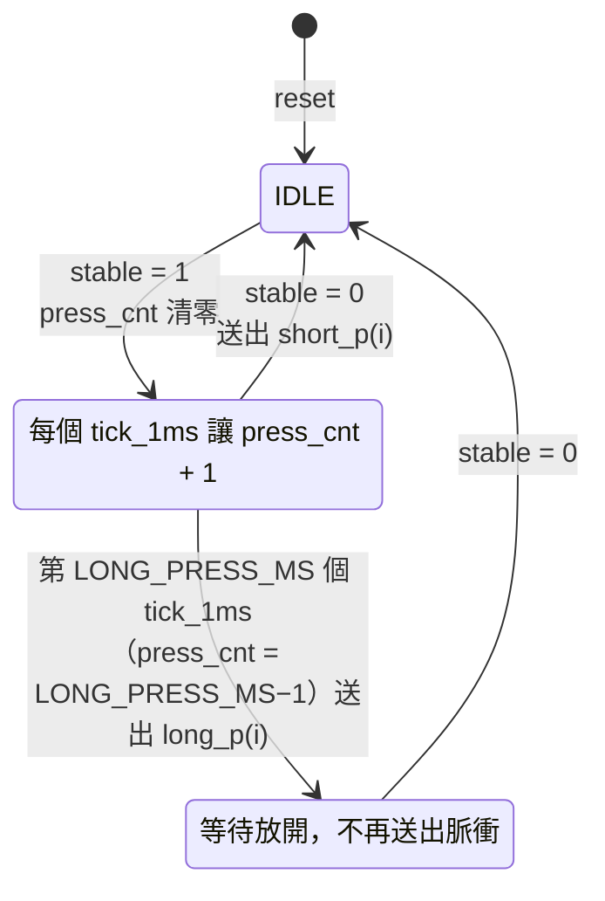

# HW2 呼吸燈規格

## 1. 目標

以 PWM 驅動 RGB LED，亮度依固定週期平滑地「漸亮 → 漸暗」循環，並可切換或漸變顏色。
設計為全同步電路，只有單一時脈域，所有時間參數皆以 generic 設定，方便在
模擬時縮短時間。

- 目標器件：`xc7k70tfbv676-1`（與 HW1 相同）
- 語言：VHDL（`ieee.numeric_std`）
- Top 模組：`HW_2`，測試檔：`HW_2_tb`

## 2. 架構


每個方塊是 `src/HW_2.vhd` 中一個編號區段的 process：

| Process | 功能 | 主要訊號 | 章節 |
|---|---|---|---|
| ① PWM 計數器 | 前除頻 + N bit 計數，標出 PWM 週期結束點 | `div_cnt`、`pwm_cnt`、`pwm_end` | §4 |
| ② 亮度 FSM | 三角波 + 最亮／最暗停留，週期固定 | `b_state`、`acc`、`level`、`sel_l`、`cycle_end` | §5 |
| ③ 1 ms 節拍 | 按鈕計時的時間基準 | `tick_cnt`、`tick_1ms` | §7.2 |
| ④ 按鈕介面 ×3 | 同步、去彈跳、短／長按判斷（`gen_btn`） | `stable`、`short_p`、`long_p` | §7.2 |
| ⑤ 設定暫存器 | 保存設定並輸出 `status` | `mode`、`hold_sel`、`breath_en` | §7.1、§7.4 |
| ⑥ 顏色控制 | 固定白光／七色序列／色輪 | `seq_idx`、`hue`、`hue_tick`、`c_x` | §6.2、§6.3 |
| ⑦ 資料路徑 ×3 | 顏色 × 亮度 → Gamma → duty 影子暫存器 | `mix_x`、`gam_x`、`duty_x` | §4.2、§5.2、§6.1 |
| ⑧ 比較器與輸出 ×3 | `pwm_cnt < duty_x`，依極性經暫存器輸出 | `led_x_reg` | §4.2 |

全部 process 由 `clk` 驅動，時序控制一律使用單拍致能脈衝（`pwm_end`、`cycle_end`、
`hue_tick`、`tick_1ms`、`short_p`、`long_p`），不產生衍生時脈。

## 3. 介面

### 3.1 Generic

| 名稱 | 型別 | 預設值 | 說明 |
|---|---|---|---|
| `CLK_FREQ_HZ` | natural | 100_000_000 | 系統時脈頻率（待確認板子） |
| `PWM_BITS` | natural | 8 | PWM 解析度 N，duty 範圍 0 ~ 2^N−1 |
| `PWM_DIV` | natural | 390 | PWM 計數器前除頻，每 `PWM_DIV` 個 clk 計數一次 |
| `CYCLE_PERIODS` | natural | 2048 | 呼吸週期（PWM 週期數），約 2.04 s；與最亮佔比無關 |
| `HOLD_BOTTOM_PERIODS` | natural | 0 | 最暗點停留的 PWM 週期數 |
| `HUE_PERIODS` | natural | 4 | 色輪每前進一步的 PWM 週期數 |
| `GAMMA_EN` | boolean | true | 是否啟用 gamma 校正 |
| `LED_ACTIVE_LOW` | boolean | false | LED 低電位點亮時設為 true（共陽極 RGB LED） |
| `DEBOUNCE_MS` | natural | 20 | 去彈跳：按鈕需連續穩定的節拍數 |
| `LONG_PRESS_MS` | natural | 1000 | 長按門檻節拍數 |
| `BTN_ACTIVE_LOW` | boolean | false | 按鈕按下為低電位時設為 true |

內部常數 `TICK_DIV = CLK_FREQ_HZ / 1000` 為 1 ms 節拍的除頻值，模擬時改小 `CLK_FREQ_HZ`
即可縮短。`CLK_FREQ_HZ` 必須是 1000 的倍數，否則節拍不是整 1 ms；以 elaboration 時的
`assert` 檢查。

### 3.2 Port

| 名稱 | 方向 | 寬度 | 說明 |
|---|---|---|---|
| `clk` | in | 1 | 系統時脈 |
| `reset` | in | 1 | 同步、高電位有效（與 HW1 相同） |
| `btn_mode` | in | 1 | 切換顏色模式，見第 7 節 |
| `btn_hold` | in | 1 | 切換最大亮度佔比，見第 7 節 |
| `btn_breath` | in | 1 | 切換呼吸／恆亮，見第 7 節 |
| `led_r` / `led_g` / `led_b` | out | 1 | PWM 輸出，各自經暫存器輸出 |
| `status` | out | 5 | 目前設定，接板上一般 LED，見 7.4 |

## 4. PWM 參數

### 4.1 計算式

```text
f_pwm = CLK_FREQ_HZ / (PWM_DIV × 2^PWM_BITS)
duty  = duty_x / 2^PWM_BITS
```

預設值：100 MHz / (390 × 256) ≈ **1001.6 Hz**，解析度 8 bit（256 階）。

| 參數 | 值 | 理由 |
|---|---|---|
| PWM 頻率 | ≈ 1 kHz | 遠高於人眼閃爍門檻（約 100 Hz），又低到 LED 驅動與走線不受影響 |
| 解析度 | 8 bit | 配合 gamma 後暗部仍有足夠階數；若暗部有明顯跳階，可改為 10 bit |
| duty 範圍 | 0 ~ 255 | 0 = 全暗；255 = 255/256 ≈ 99.6%（不需要 100%） |

### 4.2 硬體行為

- 前除頻器 `div_cnt`：0 ~ `PWM_DIV`−1 循環。
- PWM 計數器 `pwm_cnt`（`PWM_BITS` bit）：`div_cnt` 歸零時加 1，自然溢位回 0。
- `pwm_end`（組合訊號）：`div_cnt = PWM_DIV−1` 且 `pwm_cnt = 2^N−1`，即 `pwm_cnt` 即將回到 0 的那一拍。
- 輸出：`led_x <= '1' when pwm_cnt < duty_x else '0'`（再依 `LED_ACTIVE_LOW` 反相），
  需經暫存器輸出，避免組合邏輯毛刺。
- **duty 只在 `pwm_end` 時更新**（影子暫存器），確保單一 PWM 週期內 duty 不變，
  不會產生不完整的脈波。
- 時序：`level` 與 `duty_x` 在同一個 `pwm_end` 更新，但 `duty_x` 載入的是管線中由前一個
  `level` 算出的值，所以 LED 亮度固定比 `level` 晚一個 PWM 週期。所有變化都延遲同樣時間，
  不影響波形；亮度歸零時換色（6.2）也因此落在 duty 為 0 的週期。

## 5. 過渡函數（亮度波形）

### 5.1 線性三角波

時間單位為 PWM 週期（每個 `pwm_end` 更新一次）。一個呼吸週期固定為 `CYCLE_PERIODS`，
分成四段：

```text
CYCLE_PERIODS = RAMP_LEN（漸亮） + TOP_LEN（最亮） + RAMP_LEN（漸暗） + HOLD_BOTTOM_PERIODS（最暗）
```

`TOP_LEN` 由最亮佔比決定（5.3），剩下的時間平分給漸亮與漸暗。所以佔比改變時，
斜坡會跟著變快或變慢，**週期不變**。



**斜坡：DDA（數位微分分析器）**

斜坡要在 `RAMP_LEN` 個 PWM 週期內走完 R = 2^N − 1 步，每步不一定是整數個週期
（例如 1024 / 255 ≈ 4.02）。以累加器 `acc` 做 Bresenham 式均勻分配，不需除法器：

```text
每個 pwm_end：
    if acc + R >= RAMP_LEN then  acc <= acc + R − RAMP_LEN;  level ± 1
    else                         acc <= acc + R
```

- 從 `acc = 0`、`level = 0` 開始，第 k 個週期後 `level = ⌊k × R / RAMP_LEN⌋`，
  第 `RAMP_LEN` 個週期剛好到達 R，所以漸亮與漸暗各精確佔 `RAMP_LEN` 個週期。
- 每個週期最多走一步，因此要求 `RAMP_LEN ≥ R`；以 elaboration 時的 `assert` 檢查
  （預設值最短的斜坡為 256 ≥ 255）。
- 硬體：一個加法器、一個比較器、`acc` 暫存器；`RAMP_LEN` 是由 `sel_l` 選擇的常數。

其他細節：

- 狀態：`UP`、`HOLD_TOP`、`DOWN`、`HOLD_BOTTOM` 四狀態 FSM，寫法與 HW1 一致。
- 停留狀態以 `hold_cnt` 計數 PWM 週期，停留 0 個週期時直接跳過該狀態。
- 亮度降到 0 時產生一拍 `cycle_end`，供顏色控制換色。

呼吸週期：

```text
T_breath = CYCLE_PERIODS / f_pwm = 2048 / 1001.6 ≈ 2.04 s（約 0.49 Hz）
```

常見舒適範圍約 2 ~ 4 s，調整 `CYCLE_PERIODS` 即可（例如 3072 ≈ 3.07 s、4096 ≈ 4.09 s）。

### 5.2 Gamma 校正

人眼對亮度的感受接近對數，線性 duty 會讓燈「很快變亮、長時間停在亮處」。因此在比較器前
加入 gamma 查表：

```text
gamma(x) = round( (2^N − 1) × (x / (2^N − 1))^2.2 )
```

- 實作為 `2^N × N bit` 的常數 ROM（預設 256 × 8 bit），以 VHDL 函式在 elaboration 時由
  `ieee.math_real` 計算產生，不需手動輸入表格；Vivado 會推論成 LUT/分散式 ROM。
- ROM 輸出經暫存器，延遲 1 拍，不影響功能（duty 只在 `pwm_end` 取用）。
- 性質：`gamma(0) = 0`、`gamma(2^N−1) = 2^N−1`、單調不減；以 elaboration 時的 `assert` 檢查。
- `GAMMA_EN = false` 時直接旁路，用於對照比較。

### 5.3 最大亮度時間佔比（`hold_sel`）

最亮停留 `TOP_LEN` 是週期的固定百分比。三張表（`TOP_NOM`、`RAMP_LEN`、`TOP_LEN`）都在
elaboration 時由 generic 算成常數，硬體只是 4 選 1 的常數多工器：

```text
TOP_NOM(i)  = CYCLE_PERIODS × {0, 25, 50, 75}%
RAMP_LEN(i) = (CYCLE_PERIODS − HB − TOP_NOM(i)) / 2
TOP_LEN(i)  = CYCLE_PERIODS − HB − 2 × RAMP_LEN(i)    -- 吸收除以 2 的餘數，總和剛好等於週期
```

| `hold_sel` | 最亮佔比 | `TOP_LEN` | `RAMP_LEN`（單程） | 單程斜坡時間 | 呼吸週期 |
|---|---|---|---|---|---|
| `00` | 0% | 0 | 1024 | 1.02 s | 2.04 s |
| `01` | 25% | 512 | 768 | 0.77 s | 2.04 s |
| `10` | 50% | 1024 | 512 | 0.51 s | 2.04 s |
| `11` | 75% | 1536 | 256 | 0.26 s | 2.04 s |

（以預設 `CYCLE_PERIODS = 2048`、`HOLD_BOTTOM_PERIODS = 0` 計算。）

- 佔比指「亮度停在最大值」的時間比例；**週期固定，佔比越高斜坡越快**。
- 百分比寫在 `TOP_NOM` 常數，要改成其他比例只需改這一行，不增加硬體。
- `hold_sel` 在每個週期開始（離開最暗點）時鎖存到 `sel_l`，整個週期的漸亮、停留、
  漸暗都用同一組長度；按鈕切換從下一個週期開始生效，不會讓當前週期變長或變短。

### 5.4 呼吸開關（`breath_en`）

| `breath_en` | 行為 |
|---|---|
| `'1'` | 正常呼吸，依 5.1 循環 |
| `'0'` | 恆亮：`level` 平滑升到最大後停在 `HOLD_TOP` |

- 關閉時若在 `DOWN` 或 `HOLD_BOTTOM`，轉回 `UP` 繼續漸亮（`DOWN` 尚未走第一步、仍在最大值時
  直接進 `HOLD_TOP`）；若在 `UP` 則照常升到最大。亮度不會跳變。
- 關閉期間停在 `HOLD_TOP`，不產生 `cycle_end`；重新開啟後，停滿 `TOP_LEN` 個週期（已停留的
  週期也算）即進入 `DOWN`。
- 被關閉打斷的那個週期長度不固定；恢復後從下一個完整週期起，週期再回到 `CYCLE_PERIODS`。
- 恆亮時顏色仍由 `mode` 決定：`01` 單色序列因沒有 `cycle_end` 而停在目前顏色；
  `10` 色輪照常旋轉。

## 6. 顏色函數

### 6.1 顏色混合

每個色版以 8 bit 表示目標顏色 `C = (Cr, Cg, Cb)`，再乘上亮度：

```text
mix_x  = (C_x × level) >> 8        -- x ∈ {r, g, b}，8 × N → (8+N) bit，取高 N bit
duty_x = gamma(mix_x)              -- GAMMA_EN = true 時
```

- 先乘亮度再做 gamma，三個色版的比例在任何亮度下都一致，顏色不會隨呼吸偏色。
- 以 `>> 8` 近似除以 255，省去除法器。代價是 `C_x = 255`、`level = 2^N−1` 時
  `mix_x = 2^N−2`，少一階，所以**最大 duty 為 `gamma(2^N−2)`**，不是 `2^N−1`：
  N = 8 時少約 0.4%，可接受；模擬用的 N = 4 則 `mix_x` 最大為 14（滿階 15），`HW_2_tb` 的 `PEAK` 已依此計算。
- 三個 8 × N 乘法器，Vivado 可推論為 DSP48 或 LUT；乘法結果經暫存器。

### 6.2 顏色模式（`mode`）

| `mode` | 名稱 | 行為 |
|---|---|---|
| `00` | 固定白光 | `C = (255, 255, 255)` |
| `01` | 單色序列 | 每個 `cycle_end` 切換到下一色：紅 → 黃 → 綠 → 青 → 藍 → 洋紅 → 白 → 紅 … |
| `10` | 色輪漸變 | 色相在呼吸過程中連續旋轉，見 6.3 |
| `11` | 保留 | 行為同 `00` |

- 單色序列以 3 bit 索引 `seq_idx` 選 7 組常數顏色（`case` 敘述，合成為小型常數表）。
- **切換顏色只在 `cycle_end`（亮度為 0）時發生**，因此換色不會被看見跳變。
- 例外：以按鈕切換 `mode` 時**立即生效**（見 7.3），讓操作有即時回饋；單色序列從紅色開始。

### 6.3 色輪（HSV 色相，S = V = 最大）

色相計數器 `hue`：0 ~ 1535（6 段 × 256），每 `HUE_PERIODS` 個 PWM 週期前進一階
（`hue_tick`），繞一圈約 1536 × 4 / 1001.6 ≈ 6.1 s。以 `seg = hue / 256`、`f = hue mod 256`
分段線性產生 RGB，只需比較與加減、無乘法：

| `seg` | R | G | B | 色相範圍 |
|---|---|---|---|---|
| 0 | 255 | f | 0 | 紅 → 黃 |
| 1 | 255 − f | 255 | 0 | 黃 → 綠 |
| 2 | 0 | 255 | f | 綠 → 青 |
| 3 | 0 | 255 − f | 255 | 青 → 藍 |
| 4 | f | 0 | 255 | 藍 → 洋紅 |
| 5 | 255 | 0 | 255 − f | 洋紅 → 紅 |

色輪輸出同樣送入 6.1 的顏色混合，因此會同時「呼吸」與「換色」。

## 7. 按鈕互動

### 7.1 操作對照

| 按鈕 | 短按（< 1 s） | 長按（≥ 1 s） |
|---|---|---|
| `btn_mode` | 顏色模式 `00 → 01 → 10 → 00`（跳過保留的 `11`） | 顏色模式回到預設 `00` |
| `btn_hold` | 最亮佔比 `00 → 01 → 10 → 11 → 00` | 最亮佔比回到預設 `00` |
| `btn_breath` | 呼吸／恆亮切換 | 回到預設「呼吸」 |

- 規則一致：**短按 = 下一個選項，長按 = 該項回預設**。要一次回復全部設定，用 `reset`。
- 三顆按鈕各自獨立處理，同時按下時各自生效，互不影響。

### 7.2 按鈕訊號處理

每顆按鈕一套相同電路，全部由 `tick_1ms` 驅動，時間不受 PWM 參數影響：

1. **極性與同步**：`btn_x xor BTN_ACTIVE_LOW` 後經兩級正反器同步。
2. **去彈跳**：每個 `tick_1ms` 比較同步後的值與目前穩定值 `stable`；連續 `DEBOUNCE_MS`
   拍不同才更新 `stable`，否則計數器清零。按下與放開都需穩定 20 ms。
3. **短／長按 FSM**：以 `stable` 為輸入，輸出單拍脈衝 `short_p(i)`、`long_p(i)`（`i` = 0 / 1 / 2 對應 mode / hold / breath）。



- 短按在**放開時**觸發，才能與長按區分；長按在滿 1 s 時立即觸發，不必等放開。
- 一次按壓只會產生一個脈衝：短按或長按擇一。
- 每顆按鈕的硬體：同步 2 FF、去彈跳計數器 5 bit、`press_cnt` 10 bit、3 狀態 FSM。

### 7.3 設定生效時機

| 設定 | 生效時機 | 理由 |
|---|---|---|
| `mode` | 下一個 `pwm_end`（立即） | 按下後需馬上看到變化；換色瞬間的跳變可接受 |
| `hold_sel` | 下一個呼吸週期開始 | 整個週期用同一組長度，週期不會被拉長或縮短，見 5.3 |
| `breath_en` | 立即，依 5.4 平滑過渡 | FSM 本身保證亮度不跳變 |

### 7.4 狀態指示（`status`）

`hold_sel` 最多延遲一個呼吸週期才看得到效果，所以把設定值直接接到板上 LED 顯示：

| bit | 內容 |
|---|---|
| `status(1 downto 0)` | `mode` |
| `status(3 downto 2)` | `hold_sel` |
| `status(4)` | `breath_en` |

`status` 為一般電位輸出、不做 PWM；板上沒有空閒 LED 時可不接腳位。

## 8. Reset 行為

`reset = '1'` 時所有計數器歸零，`level = 0`，FSM 回到 `UP`，`sel_l`、`acc` 清為 0，顏色索引與 `hue` 回到 0（紅色，
`mode = 00` 時為白色），LED 輸出為熄滅電位。設定暫存器回到預設：`mode = 00`、
`hold_sel = 00`、`breath_en = '1'`；按鈕 FSM 回到 `IDLE`。

## 9. 驗證計畫（`HW_2_tb`）

模擬時覆寫 generic 以縮短時間，例如 `PWM_BITS = 4`、`PWM_DIV = 2`、`CYCLE_PERIODS = 192`、
`HOLD_BOTTOM_PERIODS = 16`、`HUE_PERIODS = 1`、
`CLK_FREQ_HZ = 10_000`（1 ms = 10 clk）、`DEBOUNCE_MS = 3`、`LONG_PRESS_MS = 20`。

| 項目 | 檢查方式 |
|---|---|
| PWM 週期 | 量測 `led_r` 兩個上升緣間距 = `PWM_DIV × 2^N` 個 clk |
| duty 正確 | 每個 PWM 週期的高電位 clk 數 = `PWM_DIV × duty_x` |
| 無毛刺 | duty 只在 `pwm_end` 改變；單一週期內只有一次上升與下降 |
| 三角波 | 亮度由 0 單調升至最大再單調降回 0 |
| Gamma | ROM 性質由設計內的 elaboration `assert` 檢查（5.2）；模擬中最亮 duty = `gamma(2^N−2)`（6.1） |
| 換色時機 | `mode = 01` 時顏色索引只在 `level = 0` 時改變 |
| 色輪 | `hue` 每段交界 RGB 連續，無跳變 |
| 固定週期 | 四種 `hold_sel` 的呼吸週期都等於 `CYCLE_PERIODS` |
| 最亮佔比 | 最亮持續週期數 = `TOP_LEN` + ⌈`RAMP_LEN` / R⌉（漸暗第一步前 level 仍為最大）；停留中切換 `hold_sel` 不影響本週期 |
| 呼吸開關 | 在四個狀態下分別短按 `btn_breath` 關閉呼吸，`level` 都單調升到最大並保持；再按一次恢復循環 |
| 極性 | `LED_ACTIVE_LOW = true` 時輸出反相 |
| 去彈跳 | 按鈕輸入加入短於 `DEBOUNCE_MS` 的抖動脈衝，`stable` 不變、不產生動作 |
| 短按 | 按住少於 `LONG_PRESS_MS` 後放開，放開時送出一次 `short_p(i)`，設定前進一格 |
| 長按 | 按住超過 `LONG_PRESS_MS`，滿門檻時送出一次 `long_p(i)`，放開時不再送出 `short_p(i)` |
| 同時按 | 同時按下兩顆按鈕，兩項設定各自正確改變 |
| 狀態指示 | `status` 與設定暫存器一致 |

## 10. 待確認

- 板子型號與時脈頻率（目前假設 100 MHz）。
- LED 型式：單色 LED 或 RGB LED、共陽或共陰（決定 `LED_ACTIVE_LOW`）、腳位配置（XDC）。
- 板上按鈕數量與極性（需 3 顆，加上 `reset` 共 4 顆；決定 `BTN_ACTIVE_LOW`）。
- 板上是否有 5 顆空閒 LED 可接 `status`。
- 作業是否指定呼吸週期、PWM 頻率或解析度。
