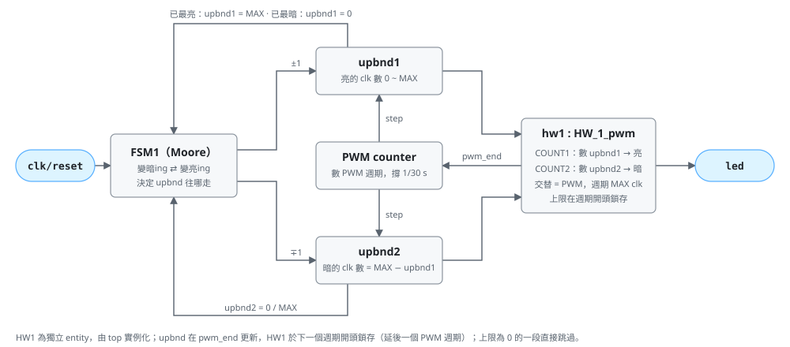
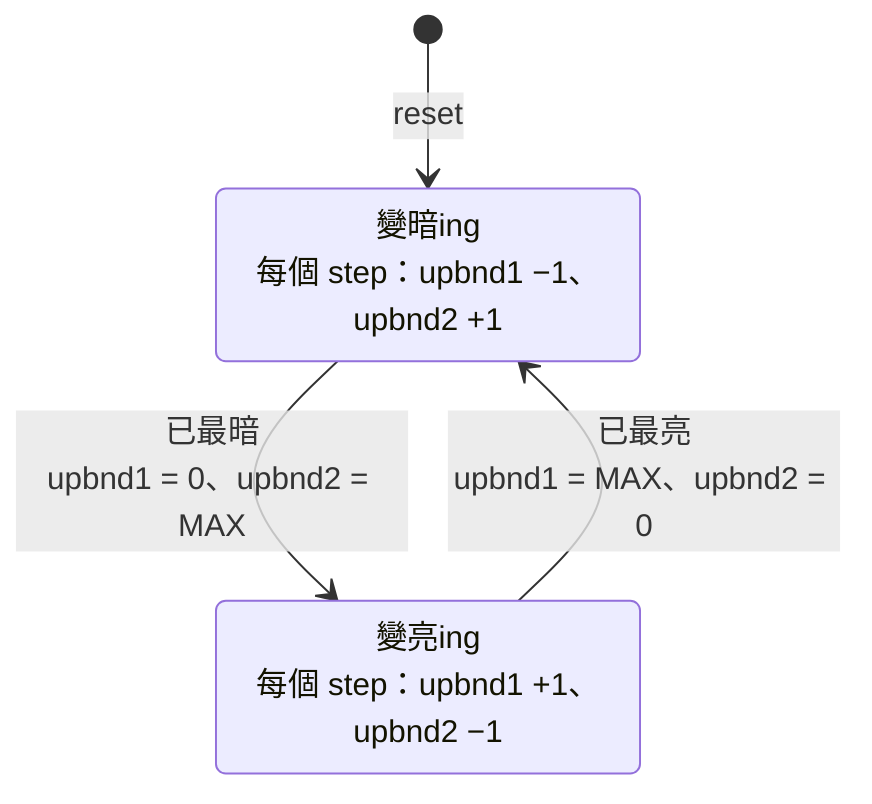

# HW2_a 呼吸燈規格（白板架構版）

## 1. 目標

依課堂白板架構實作單色呼吸燈：以兩狀態 FSM（FSM1）控制亮暗比例，並重用 HW1 的
雙計數器 FSM 產生 PWM。全同步設計、單一時脈域，時間參數皆為 generic。

- 目標器件：`xc7k70tfbv676-1`（與 HW1 相同）
- 語言：VHDL（`ieee.numeric_std`）
- Top 模組：`HW_2_a`，測試檔：`HW_2_a_tb`（看波形）、`HW_2_a_check_tb`（自我檢查）
- 另一版（RGB、按鈕、Gamma）見 [`../HW2`](../HW2/SPEC.md)

## 2. 架構



| 區塊 | 功能 | 原始碼區段 |
|---|---|---|
| FSM1 | 變暗ing／變亮ing 兩狀態 Moore FSM，決定 `upbnd1`、`upbnd2` 往哪個方向走 | 1、2 |
| `upbnd1` / `upbnd2` | 亮、暗兩段的上限，和固定為 `MAX`；每一階依 FSM1 狀態 `++` / `--` | 3 |
| HW1 | 雙計數器 FSM：count1 數 `upbnd1` 個 clk（亮）、count2 數 `upbnd2` 個 clk（暗），交替進行即為 PWM | 4 – 7 |
| PWM counter | 數 PWM 週期，撐滿 1/`STEP_HZ` 秒送出 `step`，讓亮度走一階 | 8 |

全部 process 由 `clk` 驅動，時序控制使用單拍致能脈衝（`pwm_end`、`step`），不產生衍生時脈。

## 3. 介面

### 3.1 Generic

| 名稱 | 型別 | 預設值 | 說明 |
|---|---|---|---|
| `CLK_FREQ_HZ` | positive | 100_000_000 | 系統時脈頻率（待確認板子） |
| `MAX` | positive | 30 | 亮度階數，也是 PWM 週期的 clk 數（`upbnd1 + upbnd2`） |
| `STEP_HZ` | positive | 30 | 每 1/`STEP_HZ` 秒亮度走一階 |
| `LED_ACTIVE_LOW` | boolean | false | LED 低電位點亮時設為 true |

內部常數 `STEP_PERIODS = CLK_FREQ_HZ / (STEP_HZ × MAX)`：每一階撐的 PWM 週期數，
以 elaboration 時的 `assert` 檢查至少為 1。

### 3.2 Port

| 名稱 | 方向 | 寬度 | 說明 |
|---|---|---|---|
| `clk` | in | 1 | 系統時脈 |
| `reset` | in | 1 | 同步、高電位有效（與 HW1 相同） |
| `led` | out | 1 | PWM 輸出 |

## 4. FSM1（亮暗方向）



- Moore FSM：`upbnd` 往哪個方向走只由狀態決定。
- reset 後 `upbnd1 = 0`、`upbnd2 = MAX`（全暗）並進入 `DIMMING`，下一拍即因「已最暗」轉到
  `BRIGHTENING`，從暗開始漸亮。
- `upbnd` 更新另有邊界保護（`upbnd1` 不超過 `MAX`、不低於 0），兩者和恆為 `MAX`。
- 亮度走完一個來回為 `2 × MAX` 階，最亮與最暗各停一階：

```text
亮度序列：0, 1, …, MAX, MAX−1, …, 1, 0, 1, …（每階撐 1/STEP_HZ 秒）
呼吸週期 = 2 × MAX / STEP_HZ = 2 × 30 / 30 = 2 s（單程 1 s）
```

## 5. HW1 雙計數器 PWM

沿用 HW1 的寫法（狀態暫存器、下一狀態邏輯、count1、count2 分開撰寫），把固定的上限換成
`upbnd1` / `upbnd2`：

| 狀態 | 動作 | LED |
|---|---|---|
| `COUNT1_STATE` | count1 由 0 數滿 `upbnd1` 個 clk | 亮 |
| `COUNT2_STATE` | count2 由 0 數滿 `upbnd2` 個 clk | 暗 |

```text
PWM 週期 = upbnd1 + upbnd2 = MAX 個 clk      （預設 30 clk = 300 ns，約 3.33 MHz）
duty     = upbnd1 / MAX                     （0 ~ 100%，共 MAX + 1 階）
```

- **上限為 0 的那一段直接跳過**：`upbnd1 = 0` 時整個週期都在 `COUNT2_STATE`（全暗），
  `upbnd2 = 0` 時整個週期都在 `COUNT1_STATE`（全亮），週期仍是 `MAX`。
- `pwm_end`：count2 數滿，或 `upbnd2 = 0` 時 count1 數滿，即 PWM 週期最後一拍。
- **`upbnd` 只在 `pwm_end` 更新**（`step` 只會在 `pwm_end` 出現），一個 PWM 週期內亮暗長度不變，
  不會產生殘缺脈波。週期結束時以更新後的 `upbnd1` 決定下一週期從亮或暗開始。
- LED 直接由狀態暫存器產生（Moore 輸出），不經組合邏輯，沒有毛刺。
- PWM 頻率由 `CLK_FREQ_HZ / MAX` 決定。若 LED 驅動電路跟不上 MHz 等級的切換，可加大 `MAX`
  （亮度階數變多、單程時間變長），或另加 clk 致能前除頻。

## 6. PWM counter（1/STEP_HZ 秒節拍）

- `pwm_cnt` 每個 `pwm_end` 加 1，數到 `STEP_PERIODS − 1` 時與 `pwm_end` 同拍送出 `step` 並歸零。
- 預設 `STEP_PERIODS = 100_000_000 / (30 × 30) = 111_111`，每階實際 111_111 × 30 clk ≈ 33.3 ms。
- 整數除法會捨去餘數，實際每階時間略短於 1/`STEP_HZ` 秒（預設誤差 < 0.001%）。

## 7. Reset 行為

`reset = '1'` 時：FSM1 回到 `DIMMING`、`upbnd1 = 0`、`upbnd2 = MAX`；HW1 回到 `COUNT2_STATE`、
count1 / count2 與 `pwm_cnt` 歸零；LED 為熄滅電位。放開 reset 的下一拍即是第一個 PWM 週期的開始。

## 8. 驗證計畫

兩個測試檔使用相同的縮小參數：

- `HW_2_a_tb`：看波形用（Vivado 專案的模擬 top，模擬時間 8100 ns）。只產生 clk / reset，
  跑約 3 次呼吸；可在波形加入 DUT 內部的 `fsm1_state`、`upbnd1`、`upbnd2`、`hw1_state` 觀察。
- `HW_2_a_check_tb`：自我檢查，`run all` 後印出 PASS / FAIL，檢查項目見下表。

模擬參數：`MAX = 8`、`STEP_HZ = 30`、`CLK_FREQ_HZ = 480`（`STEP_PERIODS = 2`）。
`HW_2_a_check_tb` 同時例化一般版與 `LED_ACTIVE_LOW = true` 版，每 `MAX` 個 clk 切成一個 PWM 週期逐一檢查：

| 項目 | 檢查方式 |
|---|---|
| Reset | reset 期間 LED 熄滅 |
| 單一脈波 | 每個週期 LED 在開頭連續亮 h 個 clk、其餘暗，週期內只有一段亮 |
| PWM 週期 | 以 `MAX` 個 clk 切窗，每窗的亮暗排列都正確，即週期固定為 `MAX` |
| 三角波 | 第 p 個週期的 h = `level(p / STEP_PERIODS)`，`level` 為 0 → `MAX` → 0 的三角波，檢查兩次完整呼吸 |
| 最亮／最暗 | 三角波中包含 h = `MAX`（全亮）與 h = 0（全暗）的週期 |
| 極性 | `LED_ACTIVE_LOW` 版輸出恰為反相 |
| 中途 reset | 漸亮途中 reset，LED 熄滅，放開後從最暗重新開始 |

## 9. 待確認

- 板子型號與時脈頻率（目前假設 100 MHz）。
- LED 極性與腳位（XDC）；LED 驅動能否承受 `CLK_FREQ_HZ / MAX` 的 PWM 頻率。
- `MAX`、`STEP_HZ` 是否有作業指定值（白板為每階撐 1/30 s）。
